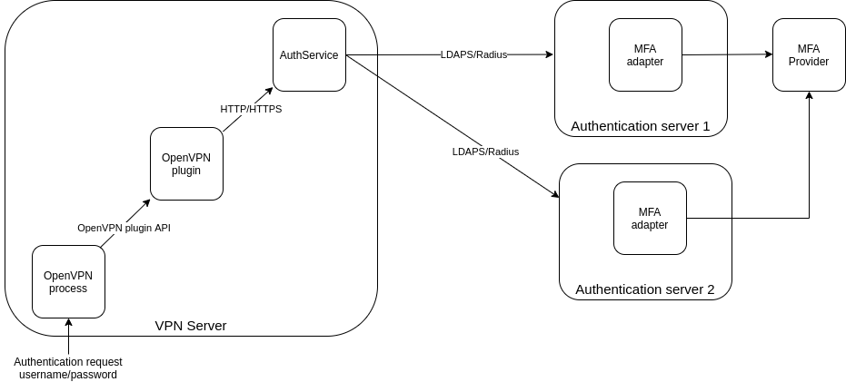
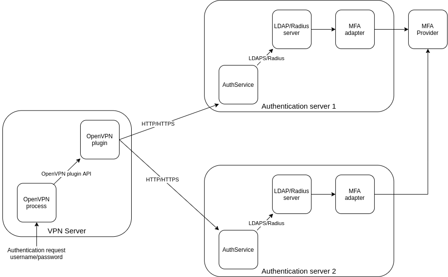

# OpenVPN multi-provider authentication plugin

The plugin allows administrators to implement multifactor authentication (via push or TOTP) for OpenVPN users. 

Avoids insecure sending plaintext username/password when using RADIUS.

When using the RADIUS server, assigning specific IP addresses to OpenVPN users is possible.

Can use multiple authentication servers for fault tolerance

Can handle more authentication requests per second than solutions with external authentication scripts.

## Features

- supports non-blocking OpenVPN plugin API;
- authentication protocols: LDAP/LDAPS, RADIUS;
- adds any multifactor authentication options (via push on a mobile phone or via TOTP) for OpenVPN clients using third-party plugins, extensions for RADIUS/LDAP servers and MFA providers (check the documentation for Octa MFA, Azure MFA, Multifactor etc.);
- can use multiple authentication servers for fault tolerance;
- authentication service status for monitoring.

### RADIUS authentication features

- supported RADIUS authentication: pap, mschapv2;
- send the IP address of OpenVPN client to RADIUS server in `Calling-Station-ID` field (can be used for detecting anomalies in SIEM software or setting additional IP adress based restrictions);
- can use fields `Framed-IP-Address`, `Framed-IP-Netmask` from RADIUS server response to assign IP-address for OpenVPN user.

## Architecture

The plugin consists of the OpenVPN plugin and authentication service. There are two possible options:

1. OpenVPN plugin and authentication service are installed on the same server.

   

2. OpenVPN plugin and authentication service are installed on separate servers. In this case, using HTTPS is highly recommended. 

   

## Installation

1. Install rust, golang from official repositories or websites.
2. Install Task from https://taskfile.dev/
3. Run

```
git clone https://github.com/osenchenko/openvpn-multi-authentication-plugin
cd openvpn-multi-authentication-plugin
task build-all
```

There will be all necessary files in directory `dist`

## Configuration

### Configuring authentication service

Check `dist/auth-service/config.yml`

Run authentication service.

### Configuring OpenVPN plugin

Check `dist/openvpn-plugin/config.yml`

### Configuring OpenVPN

For using plugin and authentication via username and password, add the following settings in the OpenVPN configuration file:

```
username-as-common-name
client-config-dir <path>
plugin <full-path-to-plugin>/libopenvpn_auth_plugin.so --config <full-path-to-config-file>
```

Run OpenVPN. 

Check logs for errors.

## Testing authentication

For RADIUS authentication, the simple RADIUS client allows setting different options and understanding if authentication is successful. 

For more complex testing configure and run auth-service. Execute:  

```
curl -H "X-Api-Key: 123456789" -X POST --data '{"u": "user", "p": "user_password", "client_ip": "127.0.0.1"}' -i http://127.0.0.1:11245/auth
```

where: 

- `X-Api-Key` is equal to `auth_api_key` from `dist/auth-service/config.yml`
- `ip` and `port` in url must be equal to `web_server` variables in `dist/auth-service/config.yml`

## Fault tolerance authentication

The authentication service can periodically try to authenticate chosen user on all available authentication servers.

If any of the servers didn't authenticate the user, then this server is considered unavailable and is not used for authentication until the next authentication check.

OpenVPN plugin can check the status of authentication services. If the authentication service is not responding, it is considered unavailable and is not used for authentication until the next monitoring check.

## Monitoring authentication service

One can monitor the authentication services by periodically checking the status URL.

To test the monitoring response, run the command.

```
curl -v -H "X-Api-Key: 1234589" http://127.0.0.1:11245/status/123455
```

where: 

- `X-Api-Key` is equal to `api_key` in `status` section from `dist/auth-service/config.yml`
- `ip` and `port` in url must be equal to `web_server` variables from `dist/auth-service/config.yml`
- path in url must be equal to `path` in `status` section from `dist/auth-service/config.yml`

### Monitoring response format

```json
{
"status_id": "{number}",
"status_text": "{string}",
"msg": "{string, optional}"
}
```

<table>
<tr>
<th>
Status
</th>
<th>
Response
</th>
<th>
Description
</th>
</tr>
<tr>
<td>
OK
</td>
<td>
<pre>
json
{
	"status_id": 1,
	"status_text": "ok",
}
</pre>
</td>
<td>
All authentication servers are available
</td>
</tr>
<tr>
<td>
Warning
</td>
<td>
<pre>
json
{
	"status_id": 2,
	"status_text": "warn",
	"msg": ""
}
</pre>
</td>
<td>
Some of the authentication servers are available.
</td>
</tr>
<tr>
<td>
Error
</td>
<td>
<pre>
json
{
	"status_id": 3,
	"status_text": "err",
	"msg": ""
}
</pre>
</td>
<td>
None of the authentication servers are available.
</td>
</tr>
</table>


